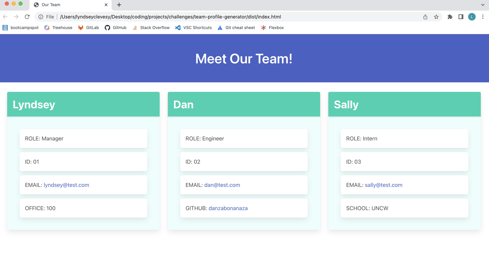

  
  
  # Team Profile Generator

  ## Description
  This application creates a team profile web page. It runs via node and leverages responses in the command line to create objects for each employee. It was built using JavaScript, Node.js, inquirer, HTML, and the Bulma CSS framework. 

  You can find a walkthrough video here: https://drive.google.com/file/d/10e3i0sdsYKPDFJwmkHxFGKWTrTf4gpzB/view.  

  Here's a screenshot of a team profile page generated via the app - 
  
  

  ## Table of Contents
  * [Installation](#installation)
  * [Usage](#usage)
  * [License](#license)
  * [Contributing](#contributing)
  * [Tests](#tests)
  * [Questions](#questions)

  ## Installation 
  To install and run this application you need to download the files from the repo https://github.com/lyndsclev/team-profile-generator. You'll also need to ensure you have initialized npm and downloaded inquirer. You will also need the JavaScript testing framework, Jest. 

  ## Usage
  To use the application, open the files in VSCode and open a terminal and type in "node index" and you will be prompted with the questions to generate your employees. When you select the option indicating your team is complete, the HTML file will be written and can be found in the dist/ folder. 

  ## License 
  This project is licensed under MIT. Please see https://opensource.org/licenses/MIT for more information.

  ## Contributing
  This application uses inquirer, the Bulma CSS framework, and was tested via Jest. 

  ## Tests
  Testing was done via Jest. When running the tests, you can see that all 4 test suites (13 tests in total) pass. This is demonstrated in the walkthrough video. 

  ## Questions 
  * https://github.com/lyndsclev
  * lyndsclev@gmail.com
  * You can also reach me with questions via LinkedIn https://www.linkedin.com/in/lyndseyclevesy/. 

